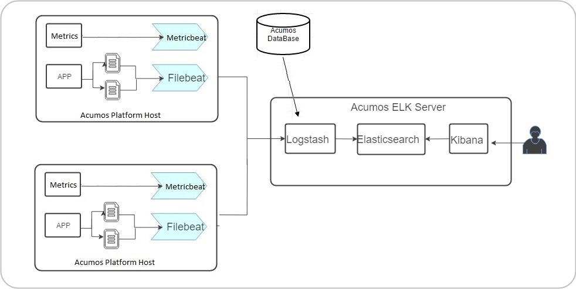
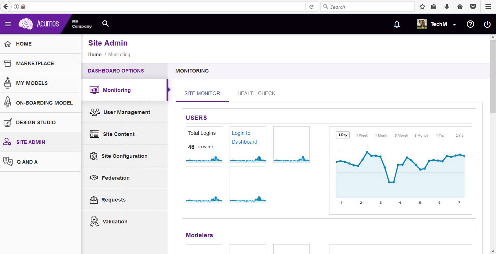
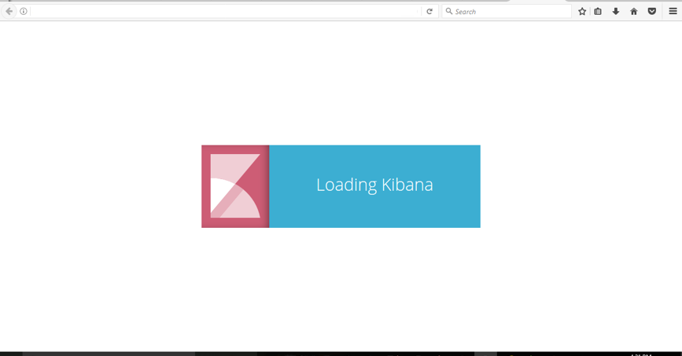
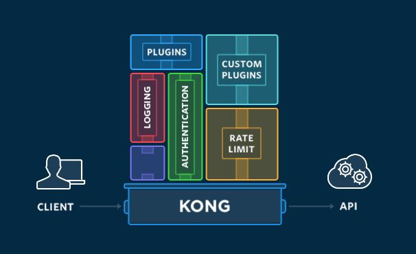

.. ===============LICENSE_START=======================================================
.. Acumos
.. ===================================================================================
.. Copyright (C) 2017-2018 AT&T Intellectual Property & Tech Mahindra. All rights reserved.
.. ===================================================================================
.. This Acumos documentation file is distributed by AT&T and Tech Mahindra
.. under the Creative Commons Attribution 4.0 International License (the "License");
.. you may not use this file except in compliance with the License.
.. You may obtain a copy of the License at
..  
..      http://creativecommons.org/licenses/by/4.0
..  
.. This file is distributed on an "AS IS" BASIS,
.. WITHOUT WARRANTIES OR CONDITIONS OF ANY KIND, either express or implied.
.. See the License for the specific language governing permissions and
.. limitations under the License.
.. ===============LICENSE_END=========================================================
=====================================================================
Platform Operations, Administration, and Management (OA&M) User Guide
=====================================================================

Operations, Administration and Management/Maintenance are the processes, activities, tools, and standards involved with operating, administering, managing and maintaining any system. 

Acumos Elastic Stack for Log Analytics
======================================
One of the functions of (OA&M) for the Acumos platform is to collect and correlate log files from the other platform components in order to support debugging, metrics, alarms, etc. for development and operations purposes. These metrics can reveal issues and potential risks so administrators can take corrective action. To this end, the OA&M component has defined a logging standard to be used by all of those components in order to support correlation. OA&M uses the `Elasticsearch, Logstack, Kibana stack <https://www.elastic.co/elk-stack>`_  and `Filebeat <https://www.elastic.co/products/beats/filebeat>`_ to collect and centralize logs that are generated via the microservices.  This guide that describes how to use the Acumos Elastic Stack (formerly known as the ELK Stack).

Target users
------------
Acumos Platform super admins

Assumptions
-----------
All the modules are following the Acumos Logging Guidelines

Elastic Stack architecture
--------------------------

Elastic Stack component versions
--------------------------------

- elasticsearch 5.5.1
- kibana:5.5.1
- logstash:5.5.1
- filebeat:6.0.1

Elastic Stack setup 
-------------------
Elastic Stack installation is automated with Docker Compose. Installation is done on a server separate from where Acumos has been installed. 

Prerequisites
-------------
`Docker <https://docs.docker.com/>`_ and `Docker Compose <https://docs.docker.com/compose/install/>_` installed

Steps
-----

1. Clone the platform-oam repository 
.. code-block:: bash
   
   $ git clone https://gerrit.acumos.org/r/platform-oam

2. The docker-compose.yaml file as well as component directories are located in the elk-stack directory. Each component has a Dockerfile. You need to build the docker-compose file if you are using it for the first time or if you have made changed any Dockerfile or the contents of its build directory.
.. code-block:: bash
	
   $ docker-compose build  
	
3. Builds, (re)creates, starts, and attaches to containers for Elasticsearch, Logstash, Kibana
.. code-block:: bash
	
   $ docker-compose up -d  	
				
		
4. To stop the running containers without removing them 
.. code-block:: bash	

   $ docker-compose stop   
		

Filebeat setup steps:
---------------------
Filebeat should be installed as an agent on the servers on which Acumos is running.
Add the configuration below to the docker-compose where the Acumos is installed.  

.. code-block:: yaml

   filebeat:
       container_name: filebeat	   
       image: <filebeat-image-name>	   
       volumes:
         - <volume-name>:/filebeat-logs
       environment:
         - LOGSTASH_HOST=<elk-stack-host-hostname>
		 - LOGSTASH_PORT=5000

Elastic Stack user interface tour
---------------------------------
Site admins have access to Elastic Stack's Kibana Dashboard. Login to the dashboard:

Kibana is an open source analytics and visualization platform designed to work with Elasticsearch. You use Kibana to search, view, and interact with data stored in Elasticsearch indices. You can easily perform advanced data analysis and visualize your data in a variety of charts, tables, and maps.
Kibana makes it easy to understand large volumes of data. Its simple, browser-based interface enables you to quickly create queries in real time.

For more details visit `Kibana User Guide <https://www.elastic.co/guide/en/kibana/5.5/index.html/>`_.

Acumos API Management with Kong
===============================

According to the `Kong website <https://getkong.org/>`_, Kong is a scalable, open source API Layer/Gateway/Middleware. The Acumos Platform uses Kong as a reverse proxy server. SSL certificates are installed on the Kong server so each containerized app doesn't have to install its own certs. Kong is highly configurable. Browse the `Kong documentation <https://getkong.org/docs/>`_ for a detailed description and user guides.

Backend Architecture

